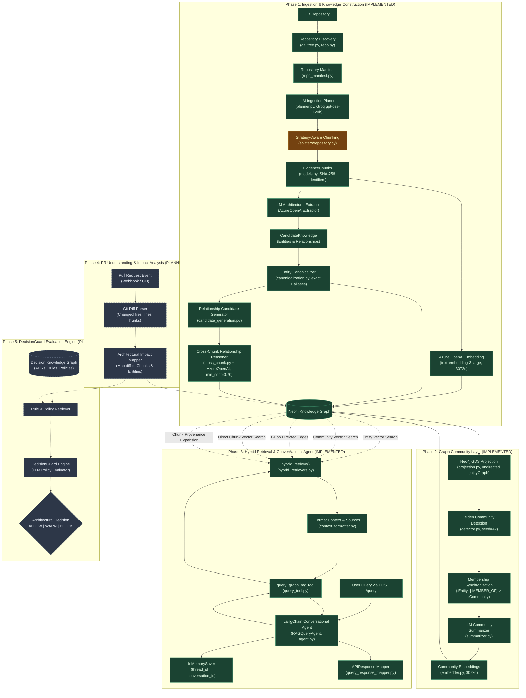
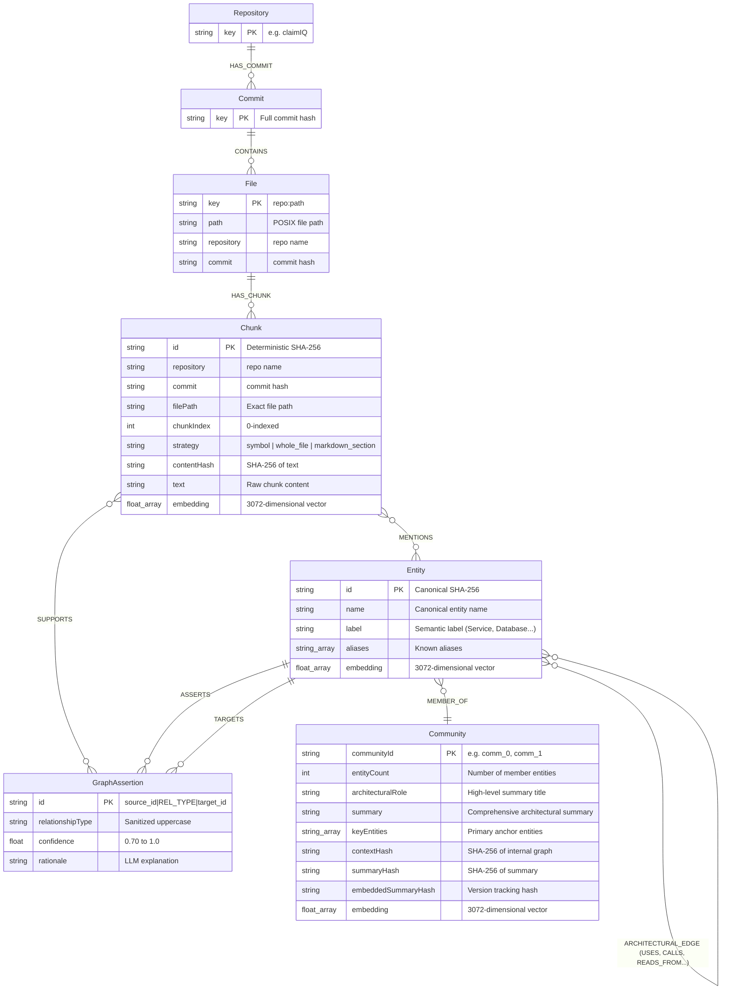
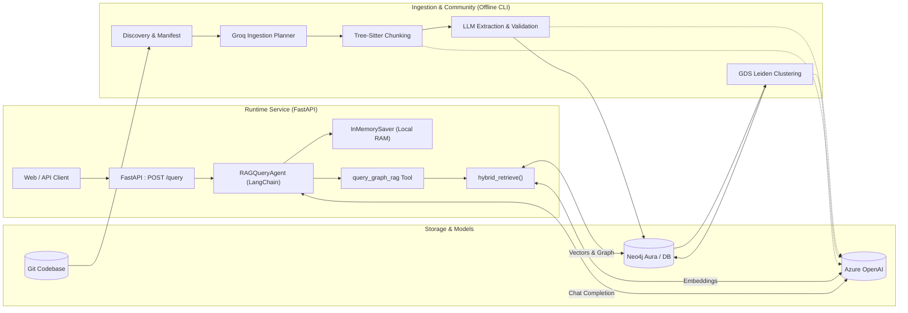
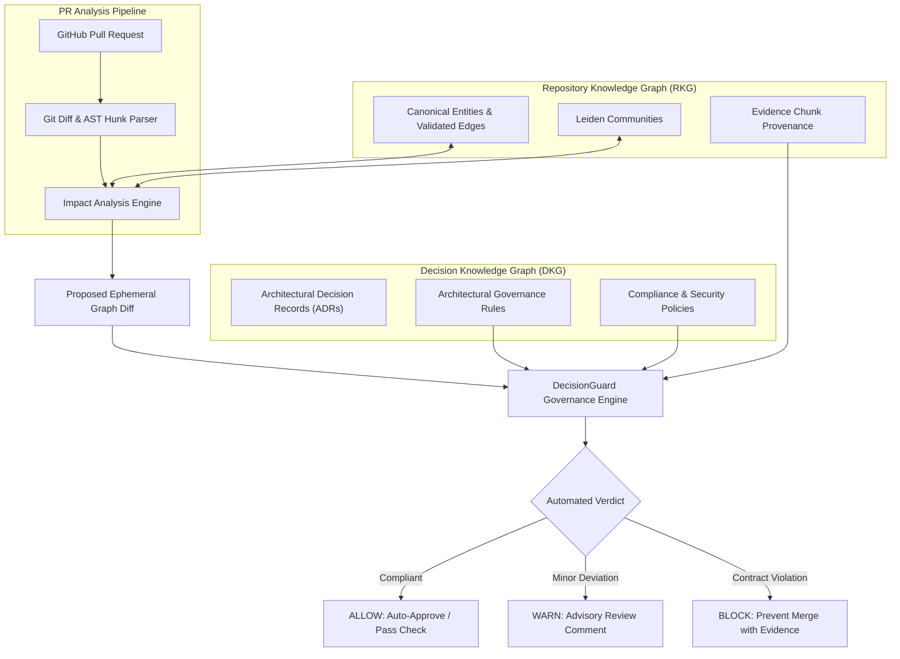

# DecisionGuard / GitHub GraphRAG: Architecture, Implementation Status, and Engineering Roadmap

> **Document Type:** Living Architecture, Implementation Status, and Engineering Handoff  
> **Status:** Single Source of Truth (SSOT)  
> **Target Audience:** Senior AI Engineers, Backend Architects, Systems Integrators, Autonomous Coding Agents  
> **Repository Root:** `E:/Studies/Dev/Gen AI/github-graphrag`  
> **Last Verified State:** October 2026  

---

## 1. Executive Summary & Problem Statement

### 1.1 The Problem
Modern software development at scale suffers from architectural entropy and blind review bottlenecks:
1. **Context Fragmentation:** Code changes in pull requests (PRs) are evaluated almost exclusively through localized diffs (`git diff`). Reviewers see *which* lines changed, but rarely know *what architectural contracts, data flows, shared interfaces, or domain invariants* are subtly altered or broken.
2. **Implicit Architectural Knowledge:** System rules (e.g., "all database queries must go through the repository layer", "payments must never call identity directly without an auth token", "schema migrations must maintain backward compatibility") live in senior engineers' heads, scattered READMEs, or stale wiki pages. They are rarely checked automatically during code review.
3. **Limitations of Standard RAG:** Standard vector RAG retrieves isolated lexical/semantic chunks based on token similarity. It cannot reason over graph topologies, indirect call chains, transitive dependencies, or macro-level architectural communities.
4. **Limitations of Pure AST Static Analysis:** Compiler-style AST parsing extracts concrete syntax trees (functions, classes, variable bindings), but completely misses high-level architectural semantics (e.g., distinguishing a critical domain boundary from a minor utility, identifying external message queues, or understanding business policies).

### 1.2 The Project Goal
The **DecisionGuard** system bridges this chasm by constructing an **AI-powered GraphRAG Repository Understanding and Architectural Decision Engine**.

The long-term objective is to evaluate pull requests against a hybrid knowledge graph:
- **Repository Knowledge Graph (RKG):** Represents the codebase's physical structure, raw evidence chunks, canonical entities, validated cross-chunk architectural relationships, and topological communities.
- **Decision Knowledge Graph (DKG):** Represents architectural rules, premises, Architectural Decision Records (ADRs), RFCs, and governance policies (planned).
- **DecisionGuard Evaluation Engine:** Computes the architectural diff of a PR, maps changes to affected entities and communities, retrieves applicable architectural rules, and emits an evidence-backed decision (`ALLOW`, `WARN`, `BLOCK`, `NEEDS_REVIEW`) directly on the PR.

```
┌───────────────────────────────────────────────────────────────────────────────────┐
│                              SYSTEM MATURITY HORIZON                              │
├────────────────────────────────┬──────────────────────────────────────────────────┤
│ CURRENT CAPABILITY (TODAY)     │ FUTURE HORIZON (PLANNED)                         │
├────────────────────────────────┼──────────────────────────────────────────────────┤
│ 1. Repository Understanding    │ 4. Decision / Rule / Policy Layer                │
│    (Git discovery, manifest,   │    (Formal ADRs, RFCs, governance policies)      │
│     planner, chunking)         │                                                  │
│                                │ 5. PR Analysis                                   │
│ 2. GraphRAG Knowledge Graph    │    (Git diff ingestion, impact mapping)          │
│    (LLM extraction, Neo4j,     │                                                  │
│     Leiden communities,        │ 6. DecisionGuard Engine                          │
│     multi-vector indexing)     │    (Rule evaluation, automated policy enforcement│
│                                │     with ALLOW / WARN / BLOCK outcomes)          │
│ 3. Conversational Querying     │                                                  │
│    (LangChain agent, hybrid    │                                                  │
│     retrieval tool, FastAPI)   │                                                  │
└────────────────────────────────┴──────────────────────────────────────────────────┘
```

> [!IMPORTANT]
> **Core Architectural Principle: Chunks are Evidence; the Graph is Knowledge.**  
> Code chunks, files, and text fragments are non-authoritative evidence. The Neo4j graph represents canonical, validated architectural knowledge. Answers and decisions must never hallucinate facts absent from the graph, and graph facts must always be grounded in traceable chunk evidence (provenance).

---

## 2. Implementation Status Classification Framework

Throughout this document, every component, module, and feature is classified into one of four strictly audited states:

| Implementation State | Definition |
| :--- | :--- |
| **`IMPLEMENTED`** | Functionality exists in code, is wired into runtime call paths, and is functional. |
| **`PARTIALLY IMPLEMENTED`** | Core scaffolding or partial functionality exists, but full integration, fallback handling, or test verification is incomplete. |
| **`PLANNED`** | Formal design, architectural hooks, or references exist in documentation/code, but runtime logic has not been written. |
| **`MISSING / NOT YET STARTED`** | No meaningful implementation or scaffolding currently exists in the repository. |

---

## 3. End-to-End Intended vs Current Architecture



---

## 4. Repository Knowledge Graph (RKG) Architecture

### 4.1 Evidence Chunks vs Architectural Knowledge
The foundational architectural thesis of this system is the strict ontological separation of **Evidence** from **Knowledge**:

```text
Raw Source Code / Files
          │
          ▼
    EvidenceChunk (Untrusted, Fragmented Repository Observation)
          │
          ├──> Vector Indexing (Direct textual semantic search)
          └──> LLM Architectural Interpretation
                    │
                    ▼
          Candidate Knowledge (Entities & Relationships)
                    │
                    ▼
          Canonicalization & Cross-Chunk Validation
                    │
                    ▼
          Authoritative Knowledge Graph (Neo4j Entities & Relationships)
                    │
                    ▼
          Provenance Pointers Back to EvidenceChunks
```

1. **EvidenceChunks are Observations:** Chunks represent verbatim slices of text at a specific point in git history. They carry content hashes, source file locations, line ranges, and vector embeddings. They are preserved indefinitely so that any architectural assertion can cite the exact lines of code that justified it.
2. **The Graph is Synthesized Knowledge:** Nodes (`Entity`) and edges (`USES`, `CALLS`, etc.) represent validated, system-wide architectural models. An entity exists across multiple chunks; a relationship may be established by code in Chunk A invoking an interface defined in Chunk B.
3. **No Hallucinated Links:** An entity or relationship cannot be written to the authoritative graph without citing one or more supporting `Chunk` IDs.

### 4.2 EvidenceChunk Specification
Defined in [`backend/ai_services/ingestion/rkg/models.py`](file:///E:/Studies/Dev/Gen%20AI/github-graphrag/backend/ai_services/ingestion/rkg/models.py#L21-L62):
```python
@dataclass(frozen=True)
class EvidenceChunk:
    chunk_id: str             # SHA-256 of repository:commit:file_path:chunk_index:content_hash
    repository: str           # Target repository name (e.g. "claimIQ")
    commit: str               # Full 40-character Git commit SHA
    file_path: str            # Repository-relative file path (POSIX)
    chunk_index: int          # 0-indexed order of chunk within the file
    text: str                 # Exact chunk body text
    content_hash: str         # SHA-256 hex digest of chunk text
    strategy: ChunkStrategy   # Strategy used (SYMBOL, MARKDOWN_SECTION, etc.)
    metadata: dict[str, Any]  # Extra metadata (symbol_type, start_line, end_line, parent_context)
    embedding: list[float] | None  # 3072-dimensional vector embedding
```

**Deterministic Identity Computation:**
```python
content_hash = sha256(text.encode()).hexdigest()
chunk_id = sha256(
    f"{repository}:{commit}:{file_path}:{chunk_index}:{content_hash}".encode()
).hexdigest()
```
This identity ensures:
- Re-chunking an identical file generates the exact same `chunk_id`.
- Chunks can be safely deduplicated and cached.
- Modifying a file changes `content_hash` and `chunk_id`, preserving commit-level historical immutability.

---

## 5. Ingestion Pipeline & Execution Trace

The ingestion pipeline transforms a raw git repository into an indexed Neo4j knowledge graph.

```text
Repository Root
       │
       ▼ [git_tree.py / repo.py]
Git Tree Traversal (ls-tree, .gitignore filtering, 2MB size cap)
       │
       ▼ [repo_manifest.py]
Hierarchical Repository Manifest JSON
       │
       ▼ [planner.py via Groq gpt-oss-120b]
Structured Ingestion Plan (Action: include/low_priority/exclude, Strategy: symbol/whole_file/...)
       │
       ▼ [splitters/repository.py]
Strategy-Aware Text Chunking
       │
       ▼ [ingestion_pipeline.py]
EvidenceChunk Creation with Deterministic IDs
       │
       ├─────────────────────────────────────────────┐
       ▼ [embeddings/azure_openai.py]                ▼ [llm_adapters.py]
Chunk Vector Embeddings (Batch: 128)           Candidate Knowledge Extraction (Tokens <= 12,000)
       │                                             │
       │                                             ▼ [canonicalization.py]
       │                                       Entity Canonicalization & Alias Registry
       │                                             │
       │                                             ▼ [candidate_generation.py]
       │                                       Relationship Candidate Generation
       │                                             │
       ▼                                             ▼ [cross_chunk.py + neo4j_writer.py]
Write Source Chunks & Constraints              Cross-Chunk Relationship Validation (LLM, Conf >= 0.70)
       │                                             │
       └──────────────────────┬──────────────────────┘
                              ▼ [neo4j_writer.py]
             Write Entities, Assertions, and Relationships
```

### Stage-by-Stage Module Audit

#### 1. Discovery
- **Modules:** [`backend/ai_services/ingestion/repo.py`](file:///E:/Studies/Dev/Gen%20AI/github-graphrag/backend/ai_services/ingestion/repo.py), [`backend/ai_services/ingestion/git_tree.py`](file:///E:/Studies/Dev/Gen%20AI/github-graphrag/backend/ai_services/ingestion/git_tree.py)
- **Status:** `IMPLEMENTED`
- **Behavior:** Executes `git ls-tree -r -l -z HEAD` inside the repository. Applies `.gitignore` rules via `git check-ignore --no-index -z --stdin`. Discards non-blob objects (submodules) and files exceeding `MAX_FILE_SIZE = 2 * 1024 * 1024` (2 MB).
- **Inputs:** Local directory path.
- **Outputs:** `list[GitFile]` with path, mode, object_id, size.
- **Limitations:** Requires local `git` binary installed on host; does not fetch remote repositories via GitHub API directly.

#### 2. Manifest Generation
- **Module:** [`backend/ai_services/ingestion/repo_manifest.py`](file:///E:/Studies/Dev/Gen%20AI/github-graphrag/backend/ai_services/ingestion/repo_manifest.py)
- **Status:** `IMPLEMENTED`
- **Behavior:** Reconstructs full directory hierarchy using `PurePosixPath`. Aggregates bottom-up file counts and byte sizes using iterative post-order tree traversal.
- **Inputs:** Repository name, commit hash, `list[GitFile]`.
- **Outputs:** `RepositoryManifest` dataclass, serializable to compact JSON.

#### 3. Ingestion Planning
- **Modules:** [`backend/ai_services/ingestion/planner.py`](file:///E:/Studies/Dev/Gen%20AI/github-graphrag/backend/ai_services/ingestion/planner.py), [`backend/ai_services/models/ingestion_plan.py`](file:///E:/Studies/Dev/Gen%20AI/github-graphrag/backend/ai_services/models/ingestion_plan.py)
- **Status:** `IMPLEMENTED`
- **Behavior:** Prompts Groq LLM (`openai/gpt-oss-120b`) with the full repository manifest tree and an architectural objective prompt. The model outputs a strict Pydantic JSON schema assigning every single manifest file:
  - `action`: `include`, `low_priority`, or `exclude`.
  - `chunk_strategy`: `symbol`, `markdown_section`, `openapi_operation`, `proto_message`, `config_section`, `whole_file`, `fallback`.
  - `reason`: Architectural rationale.
  - `language`: Canonical language name (e.g., `python`, `typescript`, `yaml`).
- **Design Rationale:** Evaluates relevance using manifest structure *without* reading entire file contents into LLM context, keeping token usage minimal.

#### 4. Chunking
- **Modules:** [`backend/ai_services/ingestion/splitters/repository.py`](file:///E:/Studies/Dev/Gen%20AI/github-graphrag/backend/ai_services/ingestion/splitters/repository.py), [`splitters/symbol.py`](file:///E:/Studies/Dev/Gen%20AI/github-graphrag/backend/ai_services/ingestion/splitters/symbol.py), [`splitters/markdown.py`](file:///E:/Studies/Dev/Gen%20AI/github-graphrag/backend/ai_services/ingestion/splitters/markdown.py), [`splitters/openapi.py`](file:///E:/Studies/Dev/Gen%20AI/github-graphrag/backend/ai_services/ingestion/splitters/openapi.py), [`splitters/proto.py`](file:///E:/Studies/Dev/Gen%20AI/github-graphrag/backend/ai_services/ingestion/splitters/proto.py), [`splitters/whole_file.py`](file:///E:/Studies/Dev/Gen%20AI/github-graphrag/backend/ai_services/ingestion/splitters/whole_file.py)
- **Status:** `PARTIALLY IMPLEMENTED`
  - `SYMBOL`: Uses `treesitter-chunker` (`chunk_text(text, language)`). Attaches `symbol_type`, `start_line`, `end_line`, `parent_context`. (`IMPLEMENTED`)
  - `MARKDOWN_SECTION`: Uses LlamaIndex `MarkdownNodeParser`. (`IMPLEMENTED`)
  - `WHOLE_FILE` / `FALLBACK`: Wraps file into single chunk. (`IMPLEMENTED`)
  - `OPENAPI_OPERATION`: Has `# TODO: parse OpenAPI paths -> methods`. Falls back to `whole_file_chunks`. (`PARTIALLY IMPLEMENTED`)
  - `PROTO_MESSAGE`: Has `# TODO: parse protobuf messages/services`. Falls back to `whole_file_chunks`. (`PARTIALLY IMPLEMENTED`)
  - `CONFIG_SECTION`: Dispatches directly to `whole_file_chunks`. (`PARTIALLY IMPLEMENTED`)

#### 5. Chunk Embedding
- **Module:** [`backend/ai_services/embeddings/azure_openai.py`](file:///E:/Studies/Dev/Gen%20AI/github-graphrag/backend/ai_services/embeddings/azure_openai.py)
- **Status:** `IMPLEMENTED`
- **Behavior:** Batches raw chunk texts into Azure OpenAI embedding API (`text-embedding-3-large`, 3072 dimensions, batch size 128). Validates vector dimensions on return.

#### 6. Architectural Extraction
- **Modules:** [`backend/ai_services/ingestion/rkg/llm_adapters.py`](file:///E:/Studies/Dev/Gen%20AI/github-graphrag/backend/ai_services/ingestion/rkg/llm_adapters.py), [`prompts.py`](file:///E:/Studies/Dev/Gen%20AI/github-graphrag/backend/ai_services/ingestion/rkg/prompts.py)
- **Status:** `IMPLEMENTED`
- **Behavior:** Batches chunks up to `max_tokens=12,000` or `max_chunks=32` via `TokenBudgetBatcher`. Formats chunks as `C1, C2, ...` to prevent raw hash hallucination. Calls Azure OpenAI with strict structured output (`response_format=ExtractionOutput`). Extracts `ExtractedEntity` and `ExtractedRelationship` objects, mapping references back to stable chunk IDs. Caches results in `.state/candidates.jsonl` for resume support.

#### 7. Entity Canonicalization
- **Module:** [`backend/ai_services/ingestion/rkg/canonicalization.py`](file:///E:/Studies/Dev/Gen%20AI/github-graphrag/backend/ai_services/ingestion/rkg/canonicalization.py)
- **Status:** `IMPLEMENTED` (Exact & Alias Matching); `PLANNED / DEFERRED` (Semantic LLM Verifier).
- **Behavior:** Normalizes `(label.strip().casefold(), name.strip().casefold())`. Generates deterministic canonical ID: `sha256(f"{scope}|{label}|{name}".encode()).hexdigest()`. Merges duplicate entities, consolidates properties, unions `evidence_chunk_ids`, and tracks aliases in `AliasRegistry`.

#### 8. Candidate Generation
- **Module:** [`backend/ai_services/ingestion/rkg/candidate_generation.py`](file:///E:/Studies/Dev/Gen%20AI/github-graphrag/backend/ai_services/ingestion/rkg/candidate_generation.py)
- **Status:** `IMPLEMENTED`
- **Behavior:** Translates extracted relationships from raw labels/names to canonical entity IDs using mapping from step 7. Prevents self-loops (`source_id == target_id`). Deduplicates identical relationship triples across chunks and unions their supporting evidence chunk IDs.

#### 9. Cross-Chunk Relationship Validation
- **Modules:** [`backend/ai_services/ingestion/rkg/cross_chunk.py`](file:///E:/Studies/Dev/Gen%20AI/github-graphrag/backend/ai_services/ingestion/rkg/cross_chunk.py), [`llm_adapters.py`](file:///E:/Studies/Dev/Gen%20AI/github-graphrag/backend/ai_services/ingestion/rkg/llm_adapters.py)
- **Status:** `IMPLEMENTED`
- **Behavior:** For each relationship candidate, fetches the supporting evidence chunks and the current 1-hop Neo4j neighborhood of both source and target entities. Calls Azure OpenAI with `RelationshipValidationOutput` (supported: bool, confidence: float, rationale: str). Rejects candidates where `supported == False` or `confidence < 0.70`.

#### 10. Neo4j Persistence
- **Module:** [`backend/ai_services/ingestion/rkg/neo4j_writer.py`](file:///E:/Studies/Dev/Gen%20AI/github-graphrag/backend/ai_services/ingestion/rkg/neo4j_writer.py)
- **Status:** `IMPLEMENTED`
- **Behavior:** Executes idempotent Cypher queries:
  1. Creates unique constraints on `Repository.key`, `File.key`, `Chunk.id`, `Entity.id`, `GraphAssertion.id`.
  2. Creates vector indexes `chunk_vector_index` and `entity_vector_index` (cosine, 3072d).
  3. Writes repository tree: `(Repository)-[:HAS_COMMIT]->(Commit)-[:CONTAINS]->(File)-[:HAS_CHUNK]->(Chunk)`.
  4. Writes canonical entities: `(Chunk)-[:MENTIONS]->(Entity)`.
  5. Writes assertions: `(Entity)-[:ASSERTS]->(GraphAssertion)-[:TARGETS]->(Entity)` and `(Chunk)-[:SUPPORTS]->(GraphAssertion)`.
  6. Writes direct architectural relationships between entities: `(s:Entity)-[:REL_TYPE]->(t:Entity)` grouped by sanitized type.

---

## 6. Architectural Extraction & Entity Canonicalization

### 6.1 Entity Types & Taxonomy
The extraction prompt [`backend/ai_services/ingestion/rkg/prompts.py`](file:///E:/Studies/Dev/Gen%20AI/github-graphrag/backend/ai_services/ingestion/rkg/prompts.py#L43-L79) guides the LLM to identify high-level architectural categories rather than low-level language variables:
- `Service`: Core business services or microservices (e.g., `ClaimService`, `AuthService`).
- `Repository`: Data access layer components (e.g., `ClaimRepository`).
- `Database`: Database engines or logical stores (e.g., `PostgreSQL`, `Neo4j`).
- `Cache` / `ObjectStore`: Redis, S3, MinIO.
- `API` / `APIEndpoint`: REST routes, gRPC services (e.g., `POST /login`, `GET /claims/{id}`).
- `Queue` / `Topic` / `Event`: Kafka topics, RabbitMQ queues, domain events.
- `DomainEntity`: Core schema contracts (e.g., `Claim`, `User`, `Policy`).
- `ExternalService`: Stripe, SendGrid, GitHub API.
- `InfrastructureComponent`: Docker, Kubernetes, Nginx.
- `Configuration`: Architecture-critical settings (e.g., database connection pool config).

**Strict Exclusion of Trivial Implementation Details:**
The extractor explicitly forbids entities for local variables, primitive values, ordinary utility helpers, control-flow statements, and incidental imports.

### 6.2 Property Normalization & Neo4j Compatibility
To prevent unstructured JSON blobs from polluting Neo4j:
- Properties must be flat scalars (`str`, `int`, `float`, `bool`) or homogeneous lists of scalars.
- Nested dictionaries, objects, maps, or arbitrary JSON structures are strictly forbidden (`ConfigDict(extra="forbid")`).
- Empty strings and null values are filtered out prior to persistence.

### 6.3 Canonicalization Strategy
Canonicalization maps disparate textual mentions to a single authoritative entity node:
1. **Normalized Key:**
   $$\text{key} = (\text{label.strip().casefold()},\ \text{name.strip().casefold()})$$
2. **Deterministic Canonical ID:**
   $$\text{canonical\_id} = \text{SHA256}(\text{scope} \parallel \text{key}_0 \parallel \text{key}_1)$$
   Where `scope` is the repository name (`claimIQ`). Commit hash is deliberately omitted from entity IDs so entity nodes remain stable across commits while chunks capture commit-level diffs.
3. **Alias Registry:** Tracks aliases (e.g., `AccountService` and `AccountSvc`). When an alias resolves, properties and chunk IDs merge into the primary entity.
4. **Deferred Semantic Resolution:** `EntityCanonicalizer` contains hooks for `semantic_candidates` and `verifier` (LLM-based semantic entity merging). In [`backend/ai_services/ingestion/rkg/builders/knowledge_pipeline.py`](file:///E:/Studies/Dev/Gen%20AI/github-graphrag/backend/ai_services/ingestion/rkg/builders/knowledge_pipeline.py#L79), this hook is intentionally instantiated without verifier callbacks (`canonicalizer=EntityCanonicalizer()`). This was a deliberate architectural choice to prevent hallucinated entity merges without extensive ground-truth verification.

---

## 7. Relationship Model & Cross-Chunk Validation

### 7.1 Preferred Canonical Relationships
The graph recognizes directed architectural edges:
- `USES`: General dependency between components.
- `CALLS`: Synchronous invocation of function, service, or API.
- `DEPENDS_ON`: Component or module structural dependency.
- `READS_FROM`: Data store read operation.
- `WRITES_TO`: Data store write/update operation.
- `EXPOSES`: Service or router exposing an API route or interface.
- `PRODUCES` / `CONSUMES`: Event messaging operations.
- `PUBLISHES_TO` / `SUBSCRIBES_TO`: Pub/sub message broker interactions.
- `IMPLEMENTS`: Concrete class implementing an architectural interface.
- `CONFIGURES`: Configuration component configuring a service or client.
- `CONNECTS_TO`: Network connection establishment.
- `DEPLOYED_ON`: Infrastructure hosting relationship.

### 7.2 The Validation Filter
Relationships extracted from individual chunks are treated as **unverified candidates**. An LLM analyzing Chunk A might hypothesize that `AuthService` calls `PaymentGateway`, but that might be a stub or comment.

The `CrossChunkReasoner` validates every candidate relationship prior to Neo4j persistence:
```python
class RelationshipValidationOutput(StrictModel):
    supported: bool        # Does the evidence actually prove this relationship?
    confidence: float      # Score between 0.0 and 1.0
    rationale: str         # Technical justification grounded in evidence
```
- **Threshold:** `minimum_confidence = 0.70`.
- **Inputs to Validator:**
  - Candidate triple: `(source, relationship_type, target)`.
  - Evidence texts from all chunks claiming this relationship.
  - Source entity metadata and target entity metadata (including aliases).
  - Graph Neighborhood: 1-hop incoming and outgoing edges already present in Neo4j for both entities.
- **Decision:** If `supported is False` or `confidence < 0.70`, the candidate is dropped. If accepted, it is persisted as both an architectural edge `(s)-[:REL]->(t)` and a reified `GraphAssertion` node with attached confidence and rationale.

---

## 8. Neo4j Graph Schema & Provenance Architecture

### 8.1 Schema Diagram



> [!IMPORTANT]
> **Property Naming Conventions in Neo4j:**  
> The database uses mixed case conventions verified directly from [`neo4j_writer.py`](file:///E:/Studies/Dev/Gen%20AI/github-graphrag/backend/ai_services/ingestion/rkg/neo4j_writer.py) and [`graph_expansion.py`](file:///E:/Studies/Dev/Gen%20AI/github-graphrag/backend/ai_services/retrievers/graph_expansion.py):
> - `Chunk`: `id`, `filePath`, `chunkIndex`, `contentHash`, `strategy`, `text`, `embedding`, `repository`, `commit`.
> - `Entity`: `id`, `name`, `label`, `aliases`, `embedding`.
> - `GraphAssertion`: `id`, `relationshipType`, `confidence`, `rationale`.
> - `Community`: `communityId`, `summary`, `architecturalRole`, `keyEntities`, `entityCount`, `contextHash`, `summaryHash`, `embeddedSummaryHash`, `embedding`.

### 8.2 Provenance Traversal Queries
Provenance is what makes GraphRAG auditable. The system answers: *"What specific lines of code in which file justify this architectural fact?"*

**1. Entity Provenance Query:**
```cypher
MATCH (e:Entity {id: $entity_id})
OPTIONAL MATCH (c1:Chunk)-[:MENTIONS]->(e)
OPTIONAL MATCH (c2:Chunk)-[:SUPPORTS]->(a:GraphAssertion)-[:ASSERTS]->(e)
RETURN e.id AS entity_id,
       collect(DISTINCT c1.id) + collect(DISTINCT c2.id) AS supporting_chunk_ids;
```

**2. Relationship Provenance Query:**
```cypher
MATCH (source:Entity {id: $source_id})-[r]->(target:Entity {id: $target_id})
OPTIONAL MATCH (source)-[:ASSERTS]->(a:GraphAssertion {relationshipType: type(r)})-[:TARGETS]->(target)
OPTIONAL MATCH (c:Chunk)-[:SUPPORTS]->(a)
RETURN type(r) AS relationship,
       a.confidence AS confidence,
       a.rationale AS rationale,
       collect(DISTINCT c.id) AS evidence_chunk_ids;
```

---

## 9. Embeddings & Vector Indexes

All semantic search across the repository uses **Azure OpenAI `text-embedding-3-large`** configured with **3072 dimensions** and cosine similarity.

```text
┌─────────────────────────┬──────────────────────┬─────────────┬──────────────────────────────────────────────────────────┐
│ Vector Index Name       │ Target Label         │ Property    │ Embedded Content                                         │
├─────────────────────────┼──────────────────────┼─────────────┼──────────────────────────────────────────────────────────┤
│ chunk_vector_index      │ :Chunk               │ embedding   │ Raw source code / markdown / specification chunk text    │
│ entity_vector_index     │ :Entity              │ embedding   │ Structured text: Name, Label, Aliases, Properties        │
│ community_vector_index   │ :Community           │ embedding   │ Full LLM synthesized community architectural summary     │
└─────────────────────────┴──────────────────────┴─────────────┴──────────────────────────────────────────────────────────┘
```

### 9.1 Entity Embedding Text Representation
To ensure entity vector search captures both name and role, [`backend/ai_services/ingestion/rkg/pipeline.py`](file:///E:/Studies/Dev/Gen%20AI/github-graphrag/backend/ai_services/ingestion/rkg/pipeline.py#L58-L74) structures entity text before embedding:
```text
Entity name: AuthService
Entity label: Service
Aliases: auth_svc, AuthController
Properties:
framework: FastAPI
port: 8000
```

### 9.2 Local Embeddings Status
[`backend/ai_services/embeddings/sentence_transformer.py`](file:///E:/Studies/Dev/Gen%20AI/github-graphrag/backend/ai_services/embeddings/sentence_transformer.py) was implemented using `all-MiniLM-L6-v2` (384 dimensions) for local offline execution. It is currently **commented out** in favor of Azure OpenAI (3072 dimensions) to maintain high-dimensional semantic fidelity across all three vector indexes.

---

## 10. Community Detection Layer (Leiden & GDS)

Community detection identifies macro-architectural clusters in the repository graph, allowing GraphRAG to summarize entire subsystems (e.g., "Authentication Subsystem", "Claims Processing Engine") instead of merely retrieving point entities.

Implemented in [`backend/ai_services/ingestion/community/`](file:///E:/Studies/Dev/Gen%20AI/github-graphrag/backend/ai_services/ingestion/community/).

### 10.1 In-Memory GDS Projection Strategy
Graph Data Science (GDS) requires an in-memory graph projection. A critical architectural design decision was made:
- **Neo4j Graph Edges:** Strictly directed (`AuthService -[:USES]-> UserRepository`).
- **GDS Projection:** Undirected (`undirectedRelationshipTypes: $relationship_types`).
- **Exclusion of Non-Architectural Edges:** `MEMBER_OF`, `MENTIONS`, `HAS_CHUNK`, `HAS_COMMIT`, and `SUPPORTS` are strictly excluded from the projection. Only true architectural relationships are projected.
- **Why?** Software components form functional subsystems through reciprocal or directed workflows. Community clustering needs to discover tightly bound clusters regardless of whether data flows in or out. However, when loading internal context for LLM summarization, the system restores strict directed paths so the LLM does not hallucinate reversed call flows.

### 10.2 Detection & Identity Strategy
- **Algorithm:** Leiden (`gds.leiden.write`) with deterministic `randomSeed: 42`. Louvain is supported as an alternate option via CLI arguments.
- **Partition Isolation:** Writes temporary partition IDs to `_gdsCommunityId` on entity nodes.
- **Identity Resolution:** Maps raw partition numbers to stable, collision-free community IDs (`comm_0`, `comm_1`, etc.).
- **Synchronization:** Merges `(:Community {communityId: ...})`, links `(e)-[:MEMBER_OF]->(c)`, removes `_gdsCommunityId`, and deletes orphan communities.

### 10.3 Decoupled Change Detection & Invariant Recovery
To avoid unnecessary LLM calls when re-running the community pipeline, [`backend/ai_services/ingestion/community/pipeline.py`](file:///E:/Studies/Dev/Gen%20AI/github-graphrag/backend/ai_services/ingestion/community/pipeline.py) computes three distinct SHA-256 hashes:
1. `contextHash`: Hash of member IDs and internal directed relationships.
2. `summaryHash`: Hash of the generated LLM architectural summary.
3. `embeddedSummaryHash`: Hash of the summary that was actually embedded into the vector index.

$$\text{Embedding Current} \iff (\text{has\_embedding} = \text{True}) \land (\text{embeddedSummaryHash} = \text{summaryHash})$$

If the graph topology of a community has not changed, summary generation is skipped. If a summary exists but its vector embedding failed or was interrupted, the embedding is regenerated without calling the summarization LLM.

---

## 11. Hybrid GraphRAG Retrieval Engine

The hybrid retrieval engine in [`backend/ai_services/retrievers/hybrid_retrievers.py`](file:///E:/Studies/Dev/Gen%20AI/github-graphrag/backend/ai_services/retrievers/hybrid_retrievers.py) is the core retrieval pipeline uniting vector search and graph traversal.

### 11.1 The 4 Retrieval Paths

```text
                                User Query
                                    │
               ┌────────────────────┼───────────────────┬───────────────────┐
               ▼                    ▼                   ▼                   ▼
      [Path 1: Entity Vector]  [Path 2: Community]  [Path 3: Graph]    [Path 4: Code Chunks]
      entity_vector_index      community_vector     1-Hop Directed     chunk_vector_index
      top_k = 5                top_k = 3            Neighborhood       top_k = 5
               │                    │                   │                   │
               │                    ▼                   │                   │
               │             Community Details          │                   │
               │             (Summary + Members)        │                   │
               │                    │                   │                   │
               ▼                    ▼                   ▼                   ▼
         Retrieved Entity IDs ───► Expand 1-Hop Adjacent Edges ───► Direct Code Evidence
               │                                                            │
               └────────────────────┬───────────────────────────────────────┘
                                    ▼
                         Provenance Chunk Lookup
                         (:Entity / :GraphAssertion) -> (:Chunk)
                                    │
                                    ▼
                         HybridRetrievalResult
                         ├── context (Formatted Markdown for LLM)
                         └── sources (Structured Metadata for API Clients)
```

1. **Path 1 (Entity Vector Retrieval):** Embeds user query, queries `entity_vector_index` for the top 5 most similar entities.
2. **Path 2 (Community Vector Retrieval):** Queries `community_vector_index` for top 3 communities. Loads their macro summaries, member entities, and internal relationships.
3. **Path 3 (Graph Expansion):** Takes retrieved entity IDs and queries Neo4j for all directed 1-hop relationships where the entity is either `source` or `target`.
4. **Path 4 (Direct Code Evidence Retrieval):** Queries `chunk_vector_index` directly for top 5 raw code/text chunks matching the query. This ensures the LLM receives literal code implementations, not just abstract node labels.
5. **Provenance Lookup:** Gathers chunk IDs supporting retrieved entities (`Chunk -[:MENTIONS]-> Entity`) and retrieved relationships (`Chunk -[:SUPPORTS]-> GraphAssertion`), loading verbatim code excerpts.

### 11.2 Retrieval Result Separation: LLM Context vs API Sources
Defined in [`backend/ai_services/retrievers/hybrid_retrievers.py`](file:///E:/Studies/Dev/Gen%20AI/github-graphrag/backend/ai_services/retrievers/hybrid_retrievers.py#L11-L15):
```python
@dataclass(frozen=True)
class HybridRetrievalResult:
    context: str                     # Formatted Markdown prompt block for the LLM
    sources: dict[str, list[dict]]   # Structured metadata (entities, communities, relationships, chunks)
```

The LLM receives `context`, formatted into clean Markdown sections by [`context_formatter.py`](file:///E:/Studies/Dev/Gen%20AI/github-graphrag/backend/ai_services/retrievers/context_formatter.py):
- `## Relevant Entities`
- `## Relevant Communities`
- `## Community Details`
- `## Graph Relationships`
- `## Direct Codebase Evidence`
- `## Entity Evidence`
- `## Relationship Evidence`

Meanwhile, `sources` preserves structured data (scores, chunk IDs, file paths, relationship endpoints) for programmatic consumers and frontend citations.

---

## 12. Conversational RAG Agent Architecture

Rather than a brittle single-turn query pipeline, the system implements a multi-turn conversational agent in [`backend/ai_services/agents/rag_agent/agent.py`](file:///E:/Studies/Dev/Gen%20AI/github-graphrag/backend/ai_services/agents/rag_agent/agent.py).

### 12.1 Agent Control Loop

```text
Client POST /query { query: "...", conversation_id: "..." }
                   │
                   ▼
        FastAPI router: query.py
                   │
                   ▼
        RAGQueryAgent.query(conversation_id, query)
                   │
                   ▼
        LangChain create_agent (AzureChatOpenAI)
        Config: { "configurable": { "thread_id": conversation_id } }
                   │
                   ├── Checkpointer: InMemorySaver (loads conversation history)
                   ├── Middleware 1: ContextEditingMiddleware (trims old tool outputs)
                   └── Middleware 2: SummarizationMiddleware (summarizes older messages)
                   │
                   ▼
        Agent evaluates conversation history + current user input
                   │
                   ├─► Resolves ambiguous references (e.g. "how is it authenticated?")
                   │
                   ▼
        Agent calls Tool: query_graph_rag(query="...")
                   │
                   ▼ [query_tool.py]
        hybrid_retrieve() -> HybridRetrievalResult
                   │
                   ├──> Returns Command(update={
                   │        "retrieval_sources": result.sources,  <-- Untracked in memory!
                   │        "messages": [ToolMessage(content=result.context)]
                   │    })
                   │
                   ▼
        Agent synthesizes final response based ONLY on retrieved evidence
                   │
                   ▼
        RAGAgentResult(answer=..., sources=...)
                   │
                   ▼ [query_response_mapper.py]
        APIResponse(answer=..., sources=[Source(...)], conversation_id=...)
```

### 12.2 Why Agentic Tool Calling Over Separate Query Rewriting
An earlier architecture attempted a 2-step pipeline: (1) Call LLM to rewrite user query based on history, (2) Pass rewritten query to GraphRAG retriever.

This was **rejected** (see commented prompt in [`prompts.py`](file:///E:/Studies/Dev/Gen%20AI/github-graphrag/backend/ai_services/agents/rag_agent/prompts.py#L1-L28)):
- A dedicated query-rewriting LLM call added 800–1500ms of latency per turn.
- The rewriter frequently broadened queries or introduced speculative terminology not present in the graph.
- An agent equipped with `query_graph_rag` as a tool can dynamically formulate its search query, evaluate if the retrieved context is sufficient, or answer conversational pleasantries without triggering retrieval at all.

### 12.3 Context Management Middlewares
GraphRAG contexts are substantial (typically 2,000–6,000 tokens per retrieval). Without active context editing, multi-turn conversations would rapidly exceed the LLM's context window.

Two middlewares are configured in [`backend/ai_services/agents/rag_agent/agent.py`](file:///E:/Studies/Dev/Gen%20AI/github-graphrag/backend/ai_services/agents/rag_agent/agent.py#L58-L72):
1. **`ContextEditingMiddleware(edits=[ClearToolUsesEdit(trigger=8000, keep=1)])`:** When total conversation tokens reach 8,000, it purges large `ToolMessage` payloads from older turns while keeping only the most recent tool output (`keep=1`). The conversation history retains what the user asked and what the assistant answered, but dumps obsolete 4KB context dumps.
2. **`SummarizationMiddleware(model=llm, max_tokens_before_summary=4000, messages_to_keep=10)`:** When message history exceeds 4,000 tokens, older messages are summarized, keeping the 10 most recent messages verbatim.
3. **`UntrackedValue` for Sources:**
   In [`backend/ai_services/agents/rag_agent/state/agent_state.py`](file:///E:/Studies/Dev/Gen%20AI/github-graphrag/backend/ai_services/agents/rag_agent/state/agent_state.py#L9-L19):
   ```python
   class RAGAgentState(AgentState):
       retrieval_sources: NotRequired[
           Annotated[dict[str, list[dict]], UntrackedValue]
       ]
   ```
   Marking `retrieval_sources` as `UntrackedValue` instructs LangGraph's checkpointer to return structured source metadata in the current invocation result, but **never serialize it into persistent conversation memory**.

---

## 13. Shared Application Infrastructure & Lifespan

Implemented in [`backend/api_services/app/main.py`](file:///E:/Studies/Dev/Gen%20AI/github-graphrag/backend/api_services/app/main.py).

### 13.1 Singleton Resource Lifecycle
The application instantiates all expensive resources once inside FastAPI's async lifespan context manager and attaches them to `app.state`:
- `GraphDatabase.driver`: Manages connection pools to Neo4j Aura / Local Neo4j. Closed gracefully in lifespan `finally:`.
- `AsyncAzureOpenAI`: Async HTTP connection-pooled client for Azure OpenAI completions and embeddings.
- `AzureOpenAIEmbedder`: Reusable embedding client.
- `AzureChatOpenAI`: LangChain chat model wrapper.
- `AzureOpenAILLM`: Low-level wrapper for raw completions.
- `entity_retriever`, `community_retriever`, `chunk_retriever`: Pre-configured Neo4j vector retrievers.
- `RAGQueryAgent`: Reusable agent instance housing `InMemorySaver`.

```text
FastAPI Lifespan Startup
       │
       ├── Neo4j Driver (connection pool)
       ├── AsyncAzureOpenAI Client (HTTP connection pool)
       ├── AzureOpenAIEmbedder
       ├── AzureChatOpenAI Model
       ├── Retrievers (VectorRetriever instances)
       └── RAGQueryAgent (agent + InMemorySaver)
       │
       ▼ Stored in app.state.deps & app.state.rag_agent
       │
Incoming HTTP Requests ---> Injected via request.app.state (Zero re-instantiation overhead)
       │
FastAPI Lifespan Shutdown
       │
       └── driver.close()
```

### 13.2 Distributed Multi-Worker Limitations
> [!WARNING]
> **Process-Local Memory Trap (`InMemorySaver`):**  
> `app.state.rag_agent` uses `InMemorySaver()`. In a single-process development environment (`uvicorn --workers 1`), conversation threads persist across requests within that worker's memory.  
> However, if deployed with multiple Uvicorn workers (`--workers 4`) or scaled across multiple container instances, requests with the same `conversation_id` routed to different processes will **not find existing history**.  
> **Production Fix Required:** Replace `InMemorySaver` with `PostgresSaver` or `RedisSaver`.

---

## 14. API Layer & Public Response Contracts

### 14.1 Endpoints
The backend runs on FastAPI, defined in [`backend/api_services/app/`](file:///E:/Studies/Dev/Gen%20AI/github-graphrag/backend/api_services/app/):
- `GET /health`: Returns `{"status": "ok"}`.
- `GET /auth/github/login`: Initiates GitHub OAuth authorization flow.
- `GET /auth/github/callback`: Handles GitHub OAuth token exchange, issues JWT.
- `POST /query`: Primary conversational GraphRAG endpoint.

### 14.2 Request and Response Contracts
Defined in [`backend/api_services/app/models/query.py`](file:///E:/Studies/Dev/Gen%20AI/github-graphrag/backend/api_services/app/models/query.py):

**Request Contract:**
```python
class QueryRequest(BaseModel):
    query: str = Field(min_length=1)
    conversation_id: str = Field(min_length=1)
```

**Public Response Contract:**
```python
class Source(BaseModel):
    file_path: str
    excerpt: str
    score: float | None = None

class APIResponse(BaseModel):
    answer: str
    sources: list[Source] = Field(default_factory=list)
    conversation_id: str
```

### 14.3 Source Mapping Decoupling
The internal `HybridRetrievalResult.sources` dictionary contains complex internal structures (entity IDs, community IDs, raw assertion rationales). The public API explicitly decouples this via [`query_response_mapper.py`](file:///E:/Studies/Dev/Gen%20AI/github-graphrag/backend/api_services/app/utils/query_response_mapper.py):
It extracts only the direct code chunks (`file_path`, `excerpt`, `score`) and presents them as a clean `list[Source]`, shielding external API clients and UI components from internal graph plumbing.

---

## 15. Authentication & Frontend Integration

### 15.1 Real Authentication Flow
Audited from [`backend/api_services/app/routers/auth.py`](file:///E:/Studies/Dev/Gen%20AI/github-graphrag/backend/api_services/app/routers/auth.py) and [`frontend/src/lib/api-client.ts`](file:///E:/Studies/Dev/Gen%20AI/github-graphrag/frontend/src/lib/api-client.ts):

```text
[Frontend / Browser]                                      [Backend FastAPI]                      [GitHub OAuth API]
         │                                                        │                                      │
         ├────── GET /auth/github/login ─────────────────────────►│                                      │
         │                                                        ├────── Authorize Redirect ───────────►│
         │◄───── Redirect to GitHub Login Page ───────────────────┤                                      │
         │                                                        │                                      │
         │────── User enters credentials on GitHub ───────────────┼─────────────────────────────────────►│
         │                                                        │                                      │
         │◄───── Redirect to /auth/github/callback?code=... ──────┼──────────────────────────────────────┤
         ├────── GET /auth/github/callback ──────────────────────►│                                      │
         │                                                        ├────── Exchange code for token ──────►│
         │                                                        │◄───── Returns access_token ──────────┤
         │                                                        ├────── GET https://api.github.com/user
         │                                                        │◄───── Returns user profile data ─────┤
         │                                                        │
         │                                                        ├─► create_access_token(jwt_payload)
         │                                                        │   (sub, username, avatar, email)
         │                                                        │   (HS256, 7-day expiration)
         │                                                        │
         │◄───── Redirect to FRONTEND_URL/auth/success?token=jwt ─┤
         │
         ├─► localStorage.setItem("token", jwt)
         │
         ├─► Axios Interceptor attaches:
         │   Authorization: Bearer <token>
```

> [!CAUTION]
> **Authentication Status & Security Gap:**
> 1. There is **no username/password authentication**, no `POST /login`, and no password hashing (`verify_password`) in the codebase. Authentication is exclusively **GitHub OAuth**.
> 2. The token is transmitted via URL parameter (`?token=...`) to `/auth/success` and stored in frontend `localStorage`, not in HTTP-only cookies.
> 3. **Critical Security Gap:** The `/query` endpoint currently has **no authentication dependency applied**. Any caller can hit `POST /query` without presenting a valid JWT token. Enforcing `get_current_user` in `query.py` is an immediate priority.

### 15.2 Frontend Stack & Current State
Audited from [`frontend/package.json`](file:///E:/Studies/Dev/Gen%20AI/github-graphrag/frontend/package.json) and [`frontend/src/`](file:///E:/Studies/Dev/Gen%20AI/github-graphrag/frontend/src/):
- **Stack:** React 19, Vite 8, TypeScript 6, Tailwind CSS v4, Radix UI / Shadcn primitives, Axios, React Router 8.
- **Implemented Screens:** Login, Register, Auth Callback (`/auth/success`), Dashboard Layout Shell (`SidebarProvider`, `AppSidebar`, `AppHeader`).
- **Missing UI Feature:** The conversational chat interface component is currently missing from `features/dashboard/page.tsx` (which renders placeholder layout cards). The frontend has not yet wired up conversational streaming or rendering for `POST /query`.

---

## 16. Current Repository Graph Statistics & Retrieval Validation

### 16.1 Last Known / Observed Ingestion State
The ingestion pipeline was verified on a complete benchmark repository: **`claimIQ`** (a multi-agent insurance claims processing backend with 77 files, FastAPI routers, LangGraph orchestration, Alembic migrations, and SQLAlchemy models).

From `.state/candidates.jsonl` and Neo4j runtime execution logs:

```text
┌───────────────────────────────────────┬───────────────────┬─────────────────────────────────────────────────┐
│ Metric                                │ Observed Value    │ Source / Verification Method                    │
├───────────────────────────────────────┼───────────────────┼─────────────────────────────────────────────────┤
│ Target Benchmark Repository           │ claimIQ           │ repository_manifest.json (commit: 930a9d2a)     │
│ Total Processed Chunks                │ 53                │ .state/candidates.jsonl line count              │
│ Chunks with Embeddings                │ 53                │ neo4j_writer.py constraint verification         │
│ Extracted Raw Entities (Pre-canon)    │ 101               │ Sum of entities across candidate knowledge      │
│ Canonical Entities (Post-canon)       │ 61                │ EntityCanonicalizer resolution output           │
│ Entities with Embeddings (3072d)      │ 61                │ Written to Neo4j :Entity nodes                  │
│ Raw Extracted Relationships           │ 69                │ Sum of relationships in candidate knowledge     │
│ Deduplicated Relationship Candidates  │ 61                │ RelationshipCandidateGenerator output           │
│ Validated Architectural Relationships │ 51                │ CrossChunkReasoner output (Conf >= 0.70)        │
│ Rejected Relationship Candidates      │ 10                │ Rejected due to missing mapping or conf < 0.70  │
│ Community Detection Algorithm         │ Leiden (seed=42)  │ run_community.py configuration                  │
│ Generated Architectural Communities   │ 6                 │ MATCH (c:Community) count                       │
│ Community Summaries & Embeddings      │ 6                 │ 100% generated and indexed in Neo4j             │
└───────────────────────────────────────┴───────────────────┴─────────────────────────────────────────────────┘
```

> [!NOTE]
> These figures represent the **last known / observed ingestion state** recorded in repository artifacts and execution logs. They serve as an empirical baseline for regression testing.

### 16.2 Example Retrieval Behavior
When querying the system with:
> *"Where is authentication handled and how does it validate users?"*

**Observed System Trace:**
1. **Entity Retrieval:** Identifies `POST /login` (`APIEndpoint`), `AuthService` (`Service`), `User` (`DomainEntity`), `verify_password` (`Function`).
2. **Community Retrieval:** Selects Community 2 (`User Authentication & Credential Verification`, similarity $\approx 0.88$).
3. **Graph Expansion:** Traverses directed relationships:
   - `POST /login -[CALLS]-> AuthService`
   - `AuthService -[READS_FROM]-> UserRepository`
   - `UserRepository -[READS_FROM]-> Database`
   - `AuthService -[USES]-> User`
4. **Direct Evidence Retrieval:** Retrieves chunks from `backend/app/api/auth.py` and `backend/app/core/security.py`.
5. **Grounded Answer Synthesis:** The agent cites `backend/app/api/auth.py`, explains the `POST /login` route, mentions password verification via `verify_password`, token creation with `create_access_token`, and the `get_current_user` dependency.

---

## 17. What We Deliberately Did NOT Do (Rejected & Deferred Approaches)

| Rejected / Deferred Approach | Why It Was Considered | Why It Was Rejected or Deferred | Current Alternative in Code |
| :--- | :--- | :--- | :--- |
| **AST-Only Deterministic Code Graph** | Explored in branch `feature/deterministic-code-graph` (commit `d76b630`). Sought 100% deterministic parsing via Python AST and Tree-sitter without LLM extraction costs. | AST parsing generates millions of low-level syntactic nodes (local variables, AST binary ops, syntax tokens) but completely lacks semantic understanding of architectural roles, business domains, external message queues, and implicit contracts. | Strategy-aware chunking (Tree-sitter symbols as evidence) coupled with LLM architectural extraction into canonical entities and validated relationships. |
| **Dedicated Query-Rewriter LLM Pipeline** | Prototyped in `prompts.py` (commented lines 1–29) to rewrite every user follow-up into a standalone retrieval string. | Incurred an unnecessary LLM round-trip latency penalty (1–1.5s per turn), frequently hallucinated terms not present in the graph, and failed when the user query was already self-contained. | LangChain conversational agent (`create_agent`) with `query_graph_rag` as a tool; the agent resolves context internally and decides when to search. |
| **Direct Answer Generation Inside Retrieval Function** | Prototyped in `run_retrieval.py` where `hybrid_retrieve()` and answer synthesis were coupled into one function. | Prevented reusability by conversational agents, made multi-turn memory impossible, and coupled retrieval scoring with generation prompt formatting. | `hybrid_retrieve()` returns `HybridRetrievalResult` (context string + structured source metadata). Agent synthesizes answer separately. |
| **Per-Request Neo4j Driver & LLM Client Allocation** | Common anti-pattern in naive FastAPI tutorials. | Neo4j drivers manage expensive socket pools and cluster routing tables. Creating them per request exhausts sockets and degrades throughput by up to 80%. | Created once during FastAPI lifespan startup, stored in `app.state.deps`, and shared across all request threads. |
| **Exposing Internal Retrieval Structures Directly to API** | Returning raw `HybridRetrievalResult` or Neo4j Cypher record dicts directly to frontend clients. | Exposes internal database node IDs, assertion metadata, and implementation details; creates tight coupling between DB schema and UI. | `query_response_mapper.py` maps internal data into public `APIResponse` and `list[Source]` containing only file paths, excerpts, and similarity scores. |
| **Persistent Storage of Full Retrieval Payloads in Chat Memory** | Saving raw GraphRAG tool contexts into LangGraph's persistent state checkpointer. | GraphRAG contexts are 2–6KB per turn. Persisting them quickly inflates memory, exceeds model token limits, and clutters history with redundant code dumps. | `UntrackedValue` annotation on `retrieval_sources` in `RAGAgentState`, plus `ClearToolUsesEdit` in `ContextEditingMiddleware` to prune old tool outputs. |
| **Unconstrained Semantic Entity Deduplication** | Attempting automatic vector-similarity entity merging during ingestion without human confirmation. | Codebases frequently contain similar names for distinct concepts (e.g., `ClaimModel`, `ClaimSchema`, `ClaimService`, `claim_id`). Unconstrained merging causes catastrophic entity conflation. | Exact normalized label/name identity hashing + `AliasRegistry`. Semantic verifier hook is architected in code but intentionally deferred. |
| **SentenceTransformers Local Embedder in Production** | Prototyped in `sentence_transformer.py` using `all-MiniLM-L6-v2` to avoid Azure OpenAI embedding API costs. | 384-dimensional local embeddings exhibited significant semantic degradation when clustering complex architectural summaries compared to `text-embedding-3-large` (3072d). | Code commented out; unified on Azure OpenAI 3072d embeddings across chunks, entities, and communities. |

---

## 18. Testing Status & Test Suite Audit

### 18.1 Current Test Suite Status
Audited via `pytest` execution in `backend/`:

```text
┌───────────────────────────────────────┬─────────┬─────────────────────────────────────────────────────────────┐
│ Test File                             │ Status  │ Audit Finding / Failure Mode                                │
├───────────────────────────────────────┼─────────┼─────────────────────────────────────────────────────────────┤
│ ai_services/tests/test_canonicalization.py │ FAILED  │ 4 passed, 1 failed:                                         │
│                                       │ (1/5)   │ test_invalid_entity_names_are_rejected_and_writer_preserves   │
│                                       │         │ _reserved_identity_fields failed with ValueError: Entity    │
│                                       │         │ valid-id is missing its embedding. Neo4j writer was         │
│                                       │         │ updated to require embeddings, but test mock lacks it.     │
├───────────────────────────────────────┼─────────┼─────────────────────────────────────────────────────────────┤
│ ai_services/tests/test_retrievers.py  │ FAILED  │ 3 passed, 1 failed:                                         │
│                                       │ (1/4)   │ test_hybrid_retrieval_combines_separate_paths_with_directed  │
│                                       │         │ _context_and_sources failed with TypeError: hybrid_retrieve │
│                                       │         │ missing 1 required positional argument: 'chunk_retriever'.  │
│                                       │         │ Signature was updated to add code evidence path; test stale.│
├───────────────────────────────────────┼─────────┼─────────────────────────────────────────────────────────────┤
│ ai_services/tests/test_neo4j.py       │ INVALID │ Not a pytest test. Contains top-level script code           │
│                                       │ TEST    │ (driver.verify_connectivity()) that executes at import time.│
├───────────────────────────────────────┼─────────┼─────────────────────────────────────────────────────────────┤
│ ai_services/tests/test_gemini.py      │ INVALID │ Not a pytest test. Contains top-level script code calling    │
│                                       │ TEST    │ external Gemini API directly. Causes pytest to hang/fail.   │
├───────────────────────────────────────┼─────────┼─────────────────────────────────────────────────────────────┤
│ api_services / routers tests          │ MISSING │ Zero unit or integration tests exist for FastAPI routers    │
│                                       │         │ (/query, /auth, /health) or middleware.                    │
├───────────────────────────────────────┼─────────┼─────────────────────────────────────────────────────────────┤
│ Conversational Agent tests            │ MISSING │ Zero tests for RAGQueryAgent, conversation continuity,      │
│                                       │         │ SummarizationMiddleware, or ClearToolUsesEdit.              │
└───────────────────────────────────────┴─────────┴─────────────────────────────────────────────────────────────┘
```

### 18.2 Critical Missing Tests (Immediate Engineering Work)
1. **Fix Broken Unit Tests:** Update `test_canonicalization.py` to provide mock embeddings on `valid` entity, and update `test_retrievers.py` to pass a mock `chunk_retriever`.
2. **Refactor Script Tests:** Convert `test_neo4j.py` and `test_gemini.py` into proper pytest test functions marked with `@pytest.mark.integration`.
3. **Conversational Multi-Turn Tests:**
   - Verify that sequential calls to `agent.query()` with the **same** `conversation_id` resolve pronouns ("how does it connect to the database?").
   - Verify that calls with **different** `conversation_ids` maintain strict isolation.
4. **Context Editing & Summarization Tests:** Test that `ContextEditingMiddleware` actually prunes tool messages when token triggers exceed 8,000 tokens.
5. **API Integration Tests:** Use `fastapi.testclient.TestClient` to test `POST /query` with valid and invalid payloads.
6. **Error Resilience Tests:**
   - Neo4j connection drop / timeout handling.
   - Azure OpenAI rate limit (429) backoff.
   - Empty retrieval handling (ensuring the agent gracefully states that no evidence was found instead of crashing).

---

## 19. Technical Debt and Operational Risks

```text
┌─────────────────────────────────┬──────────┬──────────────────────────────────────────────────────────────────────────┐
│ Risk / Debt Item                │ Severity │ Technical Explanation & Impact                                           │
├─────────────────────────────────┼──────────┼──────────────────────────────────────────────────────────────────────────┤
│ Process-Local InMemorySaver     │ CRITICAL │ Conversation memory lives in RAM of a single Python process. Deploying    │
│                                 │          │ with multiple Uvicorn workers or containers breaks chat history continuity│
│                                 │          │ across load-balanced requests. Must be replaced with Postgres/Redis.     │
├─────────────────────────────────┼──────────┼──────────────────────────────────────────────────────────────────────────┤
│ Unprotected /query Endpoint     │ CRITICAL │ /query has no authentication or rate limiting applied. Any network client │
│                                 │          │ can trigger expensive Azure OpenAI and Neo4j queries anonymously.         │
├─────────────────────────────────┼──────────┼──────────────────────────────────────────────────────────────────────────┤
│ Broken Unit Test Suite          │ HIGH     │ Existing test suite has signature drift (chunk_retriever missing in test)│
│                                 │          │ and top-level scripts that break CI test automation.                     │
├─────────────────────────────────┼──────────┼──────────────────────────────────────────────────────────────────────────┤
│ Stale Graph on Code Changes     │ HIGH     │ Ingestion is currently snapshot-based. Modifying code in the repository   │
│                                 │          │ does not update Neo4j incrementally. Re-running requires dropping or      │
│                                 │          │ full re-merging of the repository graph.                                 │
├─────────────────────────────────┼──────────┼──────────────────────────────────────────────────────────────────────────┤
│ Incomplete Splitters            │ MEDIUM   │ OpenAPI, Protobuf, and Config splitters currently fall back to whole-file│
│                                 │          │ chunking, reducing extraction granularity for API specs and protos.       │
├─────────────────────────────────┼──────────┼──────────────────────────────────────────────────────────────────────────┤
│ Synchronous Script Runs         │ MEDIUM   │ Ingestion and community detection run as manual CLI scripts in ai_services│
│                                 │          │ /runs/. There is no background task queue (Celery/Temporal) for async jobs│
├─────────────────────────────────┼──────────┼──────────────────────────────────────────────────────────────────────────┤
│ Frontend Chat Disconnection     │ MEDIUM   │ Vite React frontend has an auth shell, but lacks the conversational chat │
│                                 │          │ UI component to stream and render query answers and source citations.    │
└─────────────────────────────────┴──────────┴──────────────────────────────────────────────────────────────────────────┘
```

---

## 20. Future Architecture: PR Understanding & DecisionGuard

The project is moving from a read-only repository understanding assistant to an active **Architectural Governance Engine for Pull Requests**.

```text
                                Pull Request (PR)
                                       │
                      ┌────────────────┴────────────────┐
                      ▼                                 ▼
             Changed Files / Hunks               PR Metadata (Title, Body, Author)
                      │
                      ▼
          [Stage 1: PR Understanding]
          1. Diff Parser parses added, modified, deleted AST blocks.
          2. Maps changed lines to existing EvidenceChunks and canonical Entities.
          3. Traverses Neo4j to identify:
             - Directly modified Entities
             - 1-Hop Adjacent Dependent Entities (Impacted consumers/callers)
             - Affected Architectural Communities
                      │
                      ▼
          [Stage 2: Architectural Impact Diff]
          Constructs ephemeral Graph Diff:
          - What existing relationships are broken/removed?
          - What new relationships are introduced?
          - Are any cross-community architectural boundaries violated?
                      │
                      ▼
          [Stage 3: Decision & Policy Knowledge Graph (DKG)]
          Retrieves applicable Architectural Rules & Policies:
          (:Rule)-[:GOVERNS]->(:Entity)
          (:Decision {ADR_ID: "ADR-004"})-[:FORBIDS]->(:Relationship {type: "CALLS"})
                      │
                      ▼
          [Stage 4: DecisionGuard Evaluation Engine]
          LLM evaluator validates PR Graph Diff against retrieved Rules:
          - Does this PR bypass the API gateway?
          - Does it introduce cyclic component dependencies?
          - Does it alter database models without a migration?
                      │
                      ▼
          [Stage 5: Automated Decision Output]
          Emits structured verdict posted to GitHub PR:
          Outcome: ALLOW | WARN | BLOCK | NEEDS_REVIEW
          Evidence: Cites impacted graph paths and supporting chunk excerpts
```

### 20.1 Codebase Graph vs PR Context Graph
A critical architectural principle must be preserved:
- **Do NOT mutate the authoritative Neo4j graph during PR analysis.**
- The repository graph in Neo4j represents the authoritative state of the base branch (`main`).
- The PR analysis engine must construct an **ephemeral in-memory Graph Diff** representing proposed mutations, evaluate that diff against the base graph and the Decision Graph, and produce its verdict without corrupting the base knowledge graph.

### 20.2 The Decision Knowledge Graph (DKG) Model (Planned)
The future schema will introduce dedicated governance nodes into Neo4j:
- `(:ADR {id: "ADR-002", title: "Decouple Identity from Payments", status: "APPROVED"})`
- `(:Rule {id: "RULE-101", description: "PaymentService must not query UserDB directly"})`
- `(:Premise {text: "Direct DB coupling prevents sharding and violates PCI-DSS"})`
- `(:Rule)-[:ENFORCES]->(:ADR)`
- `(:Rule)-[:FORBIDS]->(:RelationshipPattern {source: "PaymentService", type: "READS_FROM", target: "UserDB"})`

---

## 21. Multi-Phase Roadmap

### Phase 0: Current Foundation (COMPLETED)
- [x] Git repository tree traversal, manifest generation, and file filtering.
- [x] LLM-driven ingestion planner (Groq `gpt-oss-120b`).
- [x] Tree-sitter symbol splitter and markdown section splitter.
- [x] Deterministic EvidenceChunk creation with SHA-256 identities.
- [x] Azure OpenAI `text-embedding-3-large` embedding pipeline (3072d).
- [x] LLM architectural extraction with Pydantic structured output.
- [x] Entity canonicalization, alias tracking, and candidate generation.
- [x] Cross-chunk relationship validation with LLM (confidence $\ge 0.70$).
- [x] Neo4j persistence for files, chunks, entities, and graph assertions.
- [x] Leiden community detection via Neo4j GDS with decoupled change detection.
- [x] Community summarization and vector indexing.
- [x] 4-path Hybrid GraphRAG retrieval (`hybrid_retrieve()`).
- [x] LangChain conversational agent (`RAGQueryAgent`) with context editing and summarization.
- [x] FastAPI lifespan infrastructure and `/query` endpoint.
- [x] GitHub OAuth integration and token issuing.

### Phase 1: Harden Conversational GraphRAG (IMMEDIATE NEXT STEPS)
- [ ] Fix broken unit tests in `test_canonicalization.py` and `test_retrievers.py`.
- [ ] Convert `test_neo4j.py` and `test_gemini.py` into formal `@pytest.mark.integration` tests.
- [ ] Enforce JWT authentication on `/query` endpoint via `Depends(get_current_user)`.
- [ ] Implement persistent checkpointer (`PostgresSaver` or `RedisSaver`) to support multi-worker Uvicorn deployment.
- [ ] Connect Vite React frontend dashboard to `POST /query` with interactive chat UI and citation display.
- [ ] Complete specialized splitters: implement OpenAPI operation chunker and Protobuf service chunker.

### Phase 2: PR Ingestion & Architectural Impact Analysis
- [ ] Build GitHub Webhook receiver for `pull_request` events.
- [ ] Implement Git Diff Parser to extract added/modified/deleted hunks and symbols.
- [ ] Build Architectural Impact Mapper: Map changed files and symbols to existing Neo4j `Chunk` and `Entity` nodes.
- [ ] Traverse graph to identify impacted downstream consumers and communities.
- [ ] Construct ephemeral in-memory Graph Diff representing proposed changes.

### Phase 3: Decision Knowledge Graph (DKG)
- [ ] Design and implement Neo4j schema for `ADR`, `Rule`, `Premise`, and `Policy`.
- [ ] Build ADR ingestion parser to extract architectural policies from repository markdown ADRs (`docs/adr/*.md`).
- [ ] Implement rule linking: `(:Rule)-[:GOVERNS]->(:Entity)` and `(:Rule)-[:FORBIDS]->(:Pattern)`.

### Phase 4: DecisionGuard Evaluation Engine
- [ ] Implement Rule & Policy Retriever: Find all rules governing entities impacted by a PR.
- [ ] Build LLM Decision Evaluator: Cross-reference proposed PR graph diff against retrieved architectural rules.
- [ ] Produce structured evaluation verdict (`ALLOW`, `WARN`, `BLOCK`, `NEEDS_REVIEW`) with cited evidence.
- [ ] Implement GitHub PR Commenter / Check Run poster to publish verdicts directly on GitHub PRs.

### Phase 5: Productionization & Scale
- [ ] Incremental graph updates: Update only chunks, entities, and communities affected by new commits without full re-ingestion.
- [ ] Distributed task execution: Migrate ingestion and community detection from local scripts to Celery / Temporal workers.
- [ ] RAGAS evaluation pipeline: Continuous evaluation of retrieval precision, context recall, and faithfulness.
- [ ] Semantic caching for vector searches to minimize Azure OpenAI API costs.

---

## 22. Recommended Immediate Engineering Next Steps

For an engineer picking up this codebase today, perform tasks in this exact order:

```text
STEP 1: FIX TEST SUITE & CI
├── Edit backend/ai_services/tests/test_canonicalization.py: Add mock embedding to CanonicalEntity in test_invalid_entity_names.
├── Edit backend/ai_services/tests/test_retrievers.py: Update test_hybrid_retrieval to pass mock chunk_retriever.
└── Refactor test_neo4j.py & test_gemini.py: Wrap top-level code into proper pytest test functions with pytest.mark.integration.

STEP 2: ENFORCE API SECURITY
├── Edit backend/api_services/app/routers/query.py:
│   Add get_current_user dependency to verify Bearer JWT token on POST /query.
└── Add test_query_router.py using FastAPI TestClient to verify 401 Unauthorized when token is missing.

STEP 3: MULTI-WORKER PERSISTENCE
├── Replace InMemorySaver in backend/ai_services/agents/rag_agent/agent.py with a database-backed checkpointer
│   (e.g., langgraph-checkpoint-postgres or langgraph-checkpoint-sqlite).
└── Verify conversation continuity across simulated worker restarts.

STEP 4: COMPLETE SPLITTERS
├── Edit backend/ai_services/ingestion/splitters/openapi.py: Parse OpenAPI JSON/YAML endpoints into discrete operation chunks.
└── Edit backend/ai_services/ingestion/splitters/proto.py: Parse .proto files into discrete message/service chunks.

STEP 5: WIRE FRONTEND CHAT UI
├── Create frontend/src/features/dashboard/components/chat-interface.tsx.
├── Call POST /query with query and conversation_id.
└── Render answer with expandable accordion for source file citations and code excerpts.
```

---

## 23. Architecture Visual Summaries

### Current State in One Picture



### Intended Final System: DecisionGuard



---

## 24. Master Implementation Status & Next Steps Matrix

| Component | Status | Codebase Evidence | Immediate Next Step |
| :--- | :--- | :--- | :--- |
| **Repository Discovery** | `IMPLEMENTED` | [`ingestion/git_tree.py`](file:///E:/Studies/Dev/Gen%20AI/github-graphrag/backend/ai_services/ingestion/git_tree.py), [`ingestion/repo.py`](file:///E:/Studies/Dev/Gen%20AI/github-graphrag/backend/ai_services/ingestion/repo.py) | Add remote GitHub API cloning/fetching support. |
| **Manifest Builder** | `IMPLEMENTED` | [`ingestion/repo_manifest.py`](file:///E:/Studies/Dev/Gen%20AI/github-graphrag/backend/ai_services/ingestion/repo_manifest.py) | Support custom ignore globs beyond `.gitignore`. |
| **Ingestion Planner** | `IMPLEMENTED` | [`ingestion/planner.py`](file:///E:/Studies/Dev/Gen%20AI/github-graphrag/backend/ai_services/ingestion/planner.py), [`models/ingestion_plan.py`](file:///E:/Studies/Dev/Gen%20AI/github-graphrag/backend/ai_services/models/ingestion_plan.py) | Provide fallback when Groq model is rate-limited. |
| **Symbol Chunking** | `IMPLEMENTED` | [`splitters/symbol.py`](file:///E:/Studies/Dev/Gen%20AI/github-graphrag/backend/ai_services/ingestion/splitters/symbol.py) (Tree-sitter) | Expand language parser configurations. |
| **OpenAPI / Proto Splitters** | `PARTIALLY IMPLEMENTED` | [`splitters/openapi.py`](file:///E:/Studies/Dev/Gen%20AI/github-graphrag/backend/ai_services/ingestion/splitters/openapi.py), [`splitters/proto.py`](file:///E:/Studies/Dev/Gen%20AI/github-graphrag/backend/ai_services/ingestion/splitters/proto.py) | Replace whole-file fallback with true path/message parsers. |
| **Vector Embeddings** | `IMPLEMENTED` | [`embeddings/azure_openai.py`](file:///E:/Studies/Dev/Gen%20AI/github-graphrag/backend/ai_services/embeddings/azure_openai.py) (3072d) | Add request caching to avoid re-embedding identical text. |
| **Architectural Extraction** | `IMPLEMENTED` | [`ingestion/rkg/llm_adapters.py`](file:///E:/Studies/Dev/Gen%20AI/github-graphrag/backend/ai_services/ingestion/rkg/llm_adapters.py), [`prompts.py`](file:///E:/Studies/Dev/Gen%20AI/github-graphrag/backend/ai_services/ingestion/rkg/prompts.py) | Benchmark prompt extraction accuracy with RAGAS. |
| **Entity Canonicalization** | `IMPLEMENTED` | [`ingestion/rkg/canonicalization.py`](file:///E:/Studies/Dev/Gen%20AI/github-graphrag/backend/ai_services/ingestion/rkg/canonicalization.py) | Test alias collision edge cases. |
| **Semantic Entity Resolution** | `PLANNED / DEFERRED` | Hooks in `EntityCanonicalizer` exist, unused in `knowledge_pipeline.py` | Implement conservative LLM verifier with manual review option. |
| **Candidate Generation** | `IMPLEMENTED` | [`ingestion/rkg/candidate_generation.py`](file:///E:/Studies/Dev/Gen%20AI/github-graphrag/backend/ai_services/ingestion/rkg/candidate_generation.py) | Handle reciprocal bidirectional candidate edge cases. |
| **Cross-Chunk Validation** | `IMPLEMENTED` | [`ingestion/rkg/cross_chunk.py`](file:///E:/Studies/Dev/Gen%20AI/github-graphrag/backend/ai_services/ingestion/rkg/cross_chunk.py) (Conf $\ge 0.70$) | Fine-tune confidence threshold against false positive rate. |
| **Neo4j Persistence & Constraints**| `IMPLEMENTED` | [`ingestion/rkg/neo4j_writer.py`](file:///E:/Studies/Dev/Gen%20AI/github-graphrag/backend/ai_services/ingestion/rkg/neo4j_writer.py) | Ensure writer handles large batched transaction timeouts. |
| **Provenance Tracking** | `IMPLEMENTED` | `Chunk-[:MENTIONS]->Entity`, `Chunk-[:SUPPORTS]->Assertion` | Expose full provenance chain in public API responses. |
| **Leiden Community Detection** | `IMPLEMENTED` | [`ingestion/community/detector.py`](file:///E:/Studies/Dev/Gen%20AI/github-graphrag/backend/ai_services/ingestion/community/detector.py), [`projection.py`](file:///E:/Studies/Dev/Gen%20AI/github-graphrag/backend/ai_services/ingestion/community/projection.py) | Add support for hierarchical multi-level Leiden partitions. |
| **Community Summaries & Vectors**| `IMPLEMENTED` | [`community/summarizer.py`](file:///E:/Studies/Dev/Gen%20AI/github-graphrag/backend/ai_services/ingestion/community/summarizer.py), [`embedder.py`](file:///E:/Studies/Dev/Gen%20AI/github-graphrag/backend/ai_services/ingestion/community/embedder.py) | Benchmark summary generation quality with architect feedback.|
| **Hybrid GraphRAG Retrieval** | `IMPLEMENTED` | [`retrievers/hybrid_retrievers.py`](file:///E:/Studies/Dev/Gen%20AI/github-graphrag/backend/ai_services/retrievers/hybrid_retrievers.py) | Fix outdated signature in `test_retrievers.py`. |
| **Conversational RAG Agent** | `IMPLEMENTED` | [`agents/rag_agent/agent.py`](file:///E:/Studies/Dev/Gen%20AI/github-graphrag/backend/ai_services/agents/rag_agent/agent.py) | Add unit tests for conversation follow-ups and token pruning.|
| **Conversation Memory Persistence**| `PARTIALLY IMPLEMENTED`| `InMemorySaver` in [`agent.py`](file:///E:/Studies/Dev/Gen%20AI/github-graphrag/backend/ai_services/agents/rag_agent/agent.py#L41) (Process-local) | Replace with PostgreSQL or Redis persistent checkpointer. |
| **FastAPI Layer** | `IMPLEMENTED` | [`api_services/app/main.py`](file:///E:/Studies/Dev/Gen%20AI/github-graphrag/backend/api_services/app/main.py), [`routers/query.py`](file:///E:/Studies/Dev/Gen%20AI/github-graphrag/backend/api_services/app/routers/query.py) | Add authentication dependency to `/query` endpoint. |
| **GitHub OAuth Authentication** | `IMPLEMENTED` | [`routers/auth.py`](file:///E:/Studies/Dev/Gen%20AI/github-graphrag/backend/api_services/app/routers/auth.py), [`jwt_utils.py`](file:///E:/Studies/Dev/Gen%20AI/github-graphrag/backend/api_services/app/utils/jwt_utils.py) | Migrate JWT transmission from URL query to HTTP-only cookie. |
| **Frontend User Interface** | `PARTIALLY IMPLEMENTED`| React 19 app shell in [`frontend/src/`](file:///E:/Studies/Dev/Gen%20AI/github-graphrag/frontend/src/) | Build Chat UI component to query `/query` and show sources. |
| **PR Ingestion & Diff Parsing** | `MISSING / NOT STARTED` | No PR diff processing code in repository | Build GitHub webhook handler and git diff AST hunk parser. |
| **PR Impact Mapping** | `PLANNED` | Described in architectural objectives | Map changed AST hunks to Neo4j Chunks and Entities. |
| **Decision Knowledge Graph (DKG)**| `PLANNED` | Mentioned in planning prompts and objectives | Design Neo4j schema for ADRs, Rules, and Policies. |
| **DecisionGuard Evaluation Engine**| `PLANNED` | System title is "DecisionGuard GraphRAG API" | Build rule evaluation engine to produce ALLOW/WARN/BLOCK. |
| **Automated Evaluation Pipeline**| `MISSING / NOT STARTED` | No RAGAS or benchmark test framework | Implement evaluation dataset and automated precision metrics.|
| **Incremental Graph Maintenance**| `PLANNED` | Discussed in community README | Implement commit-diff-driven graph and community patching. |
